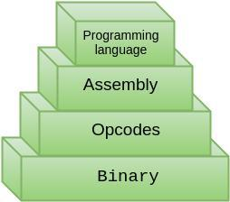

# Computencio
[](https://travis-ci.org/Cicko/Computencio)

Computencio is a funny educational game written in C++ using Cocos2d-x Framework which purpose is to provide a slight idea about
computer programming layers but has the desire to have all kinds of possible levels to understand the concepts related to computer science like sortings algorithms, hardware implementation, etc..:



This pyramid represents the layers that I primarily want to introduce. Each layer is known by different game levels. Also this game is very extensible thanks to the __open/close__ principle. In the [__HOW_TO_CONTRIBUTE.md__](HOW_TO_CONTRIBUTE.md) file is explained very well different ways to contribute to this game, is highly recommended to read this [__file__](HOW_TO_CONTRIBUTE.md) specially if it's the first time you want to contribute to a open source software project.


### Used Framework

This game is based on [cocos2d-x](https://en.wikipedia.org/wiki/Cocos2d) framework. Is an open source software framework. You can search a lot of useful sites for master it:
- [Official Manual](http://www.cocos2d-x.org/docs/)
- [Useful Youtube playlist](https://www.youtube.com/watch?v=qXqgSNUf9Cc&list=PLRtjMdoYXLf4od_bOKN3WjAPr7snPXzoe)
- [Official Forum](http://discuss.cocos2d-x.org/)

### Dependencies

You will have to download all the dependencies you need depending the platform you want to develop on.

- [Linux Setup](http://www.cocos2d-x.org/docs/installation/F/)
- [Windows Setup](http://www.cocos2d-x.org/docs/installation/G/)
- [IOS Setup](http://www.cocos2d-x.org/docs/installation/D/)
- [Mac OS X Setup](http://www.cocos2d-x.org/docs/installation/E/)
- [Android (terminal) Setup](http://www.cocos2d-x.org/docs/installation/B/)
- [Android (eclipse) Setup](http://www.cocos2d-x.org/docs/installation/C/)


### About this repo


- In the __Classes__ folder are all source codes of this game (cpp and h files).
- Files like __proj.android__ or __proj.linux__ are folders containing basic configuration of its
platform. Also there are __proj.android-studio__ folder so you can use this project easily with Android Studio IDE.
- The __Resources__ folder contain just that, resources such images and fonts.

### How to contribute

##### 1. Clone Project

First thing you have to do to contribute is to clone this project and

```bash
git clone https://github.com/Computencio/computencio.git
```
##### 2. Create a symbolic link

Now create a [symbolic link](https://en.wikipedia.org/wiki/Symbolic_link) named __cocos2d__ to our downloaded  [cocos2d-x library](http://www.cocos2d-x.org/filedown/cocos2d-x-3.10.zip).

```bash
cd computencio
ln path-to-cocos-lib cocos2d
```

##### 3. Create platform specific build folder

Now you have to create _platform-build_ folder like __linux-build__, go inside and construct it with cmake (CMakeLists.txt file at root of this repo). Finally execute make to create configuration files for all platforms (this will delay few minutes). In case to have some errors you can visit the [cocos2d forum](http://discuss.cocos2d-x.org/)

```bash
mkdir linux-build
cd linux-build
cmake ..
make
```

##### 4. Execute it

If everything has been executed successfully now you can compile and execute the game (the first time it will delay few minutes):
```bash
cocos run -p android

cocos run -p linux
```

__Run__ command will compile and execute the project. Its recommended to have a look to [cocos2d console manual](http://www.cocos2d-x.org/wiki/Cocos2d-console)

##### 5. Adding new source code

If you want add new source code files to project ensure that you add the
respective path to following files:
- __CMakeList.txt__
- __proj.android/jni/Android.mk__

I highly recommend to have a look to [HOW_TO_CONTRIBUTE.md](HOW_TO_CONTRIBUTE.md) if you want to add new levels or functionalities to Computencio.
